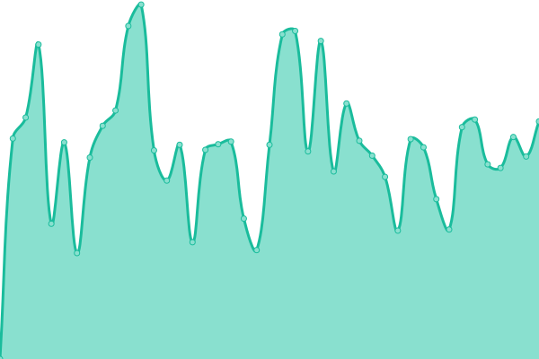
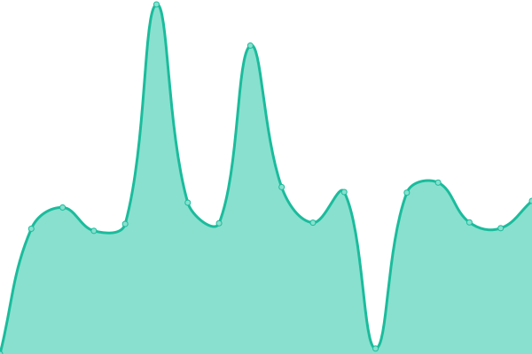
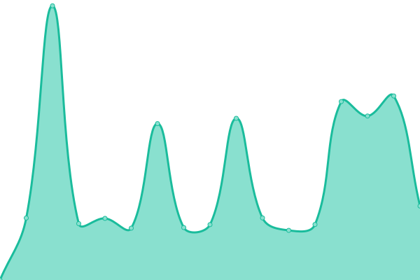
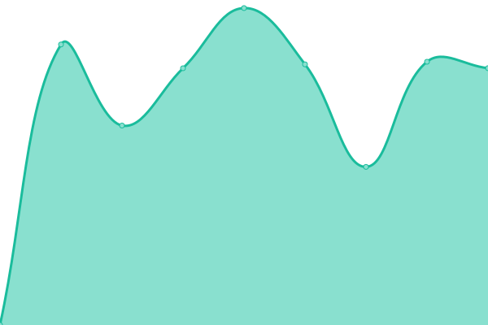

# [📈 Live Status](https://campocta.github.io/APIs-Metrics): <!--live status--> **🟩 All systems operational**

This repository contains the open-source uptime monitor and status page for [Campo Analises](https://campoanalises.com.br), powered by [Upptime](https://github.com/upptime/upptime).

With [Upptime](https://upptime.js.org), you can get your own unlimited and free uptime monitor and status page, powered entirely by a GitHub repository. We use [Issues](https://github.com/campocta/APIs-Metrics/issues) as incident reports, [Actions](https://github.com/campocta/APIs-Metrics/actions) as uptime monitors, and [Pages](https://campocta.github.io/APIs-Metrics) for the status page.

<!--start: status pages-->
<!-- This summary is generated by Upptime (https://github.com/upptime/upptime) -->
<!-- Do not edit this manually, your changes will be overwritten -->
<!-- prettier-ignore -->
| URL | Status | History | Response Time | Uptime |
| --- | ------ | ------- | ------------- | ------ |
|  [API Geral - Data 1 (2025-04-01 a 2025-04-30)](http://api.campoanalises.com.br:1089/api-campo/amostras?inicio=2025-04-01&fim=2025-04-30) | 🟩 Up | [api-geral-data-1-2025-04-01-a-2025-04-30.yml](https://github.com/campocta/APIs-Metrics/commits/HEAD/history/api-geral-data-1-2025-04-01-a-2025-04-30.yml) | 

 9571ms
     
 | 

<a href="https://campocta.github.io/APIs-Metrics/history/api-geral-data-1-2025-04-01-a-2025-04-30">74.29%</a>
    

|  [API Geral - Data 2 (2025-06-01 a 2025-06-30)](http://api.campoanalises.com.br:1089/api-campo/amostras?inicio=2025-06-01&fim=2025-06-30) | 🟩 Up | [api-geral-data-2-2025-06-01-a-2025-06-30.yml](https://github.com/campocta/APIs-Metrics/commits/HEAD/history/api-geral-data-2-2025-06-01-a-2025-06-30.yml) | 

 5760ms
     
 | 

<a href="https://campocta.github.io/APIs-Metrics/history/api-geral-data-2-2025-06-01-a-2025-06-30">81.53%</a>
    

|  [API Geral - Data 3 (2025-07-01 a 2025-07-30) e offset](http://api.campoanalises.com.br:1089/api-campo/amostras?inicio=2025-07-01&fim=2025-07-30&offset=5) | 🟩 Up | [api-geral-data-3-2025-07-01-a-2025-07-30-e-offset.yml](https://github.com/campocta/APIs-Metrics/commits/HEAD/history/api-geral-data-3-2025-07-01-a-2025-07-30-e-offset.yml) | 

 5624ms
     
 | 

<a href="https://campocta.github.io/APIs-Metrics/history/api-geral-data-3-2025-07-01-a-2025-07-30-e-offset">82.65%</a>
    

|  [API Terradot - Sem Filtros](http://api.campoanalises.com.br:6020/api/samples) | 🟩 Up | [api-terradot-sem-filtros.yml](https://github.com/campocta/APIs-Metrics/commits/HEAD/history/api-terradot-sem-filtros.yml) | 

 5855ms
     
 | 

<a href="https://campocta.github.io/APIs-Metrics/history/api-terradot-sem-filtros">82.11%</a>
    

|  [API Terradot - Limit (30) e Offset (3000)](http://api.campoanalises.com.br:6020/api/samples?limit=30&offset=1000) | 🟩 Up | [api-terradot-limit-30-e-offset-3000.yml](https://github.com/campocta/APIs-Metrics/commits/HEAD/history/api-terradot-limit-30-e-offset-3000.yml) | 

 2365ms
     
 | 

<a href="https://campocta.github.io/APIs-Metrics/history/api-terradot-limit-30-e-offset-3000">83.14%</a>
    

|  [API Terradot - Start Date (2025-05-01) e Offset (2025-07-01)](http://api.campoanalises.com.br:6020/api/samples?start_date=2025-05-01&end_date=2025-07-01) | 🟩 Up | [api-terradot-start-date-2025-05-01-e-offset-2025-07-01.yml](https://github.com/campocta/APIs-Metrics/commits/HEAD/history/api-terradot-start-date-2025-05-01-e-offset-2025-07-01.yml) | 

 2201ms
     
 | 

<a href="https://campocta.github.io/APIs-Metrics/history/api-terradot-start-date-2025-05-01-e-offset-2025-07-01">100.00%</a>
    

|  [API Terradot - Budget Number (14535/2025)](http://api.campoanalises.com.br:6020/api/samples?budgetNumber=14535%2F2025) | 🟩 Up | [api-terradot-budget-number-14535-2025.yml](https://github.com/campocta/APIs-Metrics/commits/HEAD/history/api-terradot-budget-number-14535-2025.yml) | 

 2052ms
     
 | 

<a href="https://campocta.github.io/APIs-Metrics/history/api-terradot-budget-number-14535-2025">83.19%</a>
    

<!--end: status pages-->

[**Visit our status website →**](https://campocta.github.io/APIs-Metrics)

## 📄 License

- Powered by: [Upptime](https://github.com/upptime/upptime)
- Code: [MIT](./LICENSE) © [Anand Chowdhary](https://anandchowdhary.com), supported by [Pabio](https://pabio.com)
- Data in the `./history` directory: [Open Database License](https://opendatacommons.org/licenses/odbl/1-0/)
